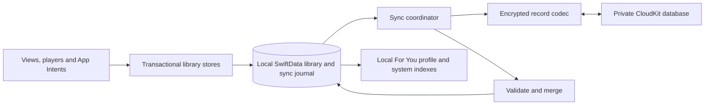

# Opt-in iCloud sync implementation plan

Status: implementation added on the `codex/icloud-sync` worktree branch. Sync remains opt-in. Container provisioning, production schema deployment, and live two-device acceptance are release gates; see [setup and verification](ICLOUD_SYNC_SETUP.md). This design is based on Atlas source and Apple documentation checked September 10, 2026.

Build an explicit CloudKit sync layer around Atlas's existing local SwiftData store. Use the user's private CloudKit database, `CKSyncEngine`, and encrypted CloudKit fields for every application-defined value. Keep local reads, edits, playback, and recommendations available offline. Enabling sync merges the device's library with the same Apple Account's cloud library.

## 1. Encryption contract and warning

Apple confirms that third-party CloudKit encrypted fields and assets receive end-to-end encryption when Advanced Data Protection (ADP) is enabled. Under standard protection, app data is encrypted during transport and storage, but Apple retains access to the relevant keys. Therefore, **CloudKit field encryption alone must not be advertised as unconditional E2EE**. Some service metadata remains outside ADP's E2EE coverage. [Apple: iCloud data security overview](https://support.apple.com/en-us/102651).

Show this before the first upload, next to the enable action, and retain it on the sync settings page:

> **About iCloud encryption**
>
> Atlas stores your synced library and activity in encrypted iCloud fields. End-to-end encryption requires Advanced Data Protection for your Apple Account. Without it, Apple holds the keys needed to decrypt this data. Some iCloud service metadata is not end-to-end encrypted, even with Advanced Data Protection.

Add a separate helper: “Check Advanced Data Protection in Settings → your name → iCloud. Atlas does not verify whether it is enabled.” Link to [Apple's setup instructions](https://support.apple.com/en-us/108756); availability depends on the account and region. No undocumented Settings URL or inferred ADP badge.

The reviewed public CloudKit documentation and installed SDK do not provide an ADP-status check to rely on. `accountStatus()` reports account availability, not encryption mode. Use conditional copy for everyone; a successful encrypted write, iCloud Keychain availability, or a user checking a checkbox does not establish ADP status.

“Everything encrypted” means **every custom value uploaded by Atlas**, including identifiers, timestamps, deletion state, relationships, preference keys, and sync coordination data. It cannot mean hiding CloudKit's record IDs, zones, record types, sizes, or operational metadata. Keep those names opaque and never place a video ID, search query, channel name, playlist name, or URL in them.

Use `CKRecord.encryptedValues` for application fields. Apple documents that encrypted fields cannot be indexed, existing plain fields cannot simply be converted, `CKRecord.Reference` is not encrypted, and `CKAsset` already receives encryption. Use local filtering and encrypted relationship identifiers instead of CloudKit references. [Apple: encryptedValues](https://developer.apple.com/documentation/cloudkit/ckrecord/encryptedvalues). Apple's current privacy guidance explicitly recommends encrypted schema types for all fields. [WWDC25: Integrate privacy into your development process](https://developer.apple.com/videos/play/wwdc2025/246/).

This design delegates content encryption and key recovery to CloudKit. An unconditional E2EE product would need a separate application encryption and recovery design; that is outside this ADP-dependent proposal. Local database protection, JSON exports, and iOS device backups are separate from this sync contract. Turning off Atlas sync does not turn off the user's system-managed iCloud Backup.

## 2. Exact data coverage

Use one master opt-in in the first release. The enable sheet lists the included categories explicitly. Per-category device toggles introduce additional merge and deletion rules and are not part of this release.

| Current data | Sync behavior | Local integration |
| --- | --- | --- |
| `SubscribedChannel` | Channel identity, display metadata, subscription time, subscribe/unsubscribe state | `SubscriptionStore` |
| `HistoryEntry` | Video metadata, last watch time, resume position, duration; removals and clear-history operations | `PlaybackHistoryStore`; both player implementations |
| `Playlist` / `PlaylistVideo` | Playlist identity/name, membership, metadata, added order, Favorites; removals/deletions | `PlaylistStore`, playlist screens, Siri, remote favorite action |
| `Feedback` | Suggest More/Less, clearing feedback, category/tags and display metadata | `FeedbackStore` |
| `SearchEntry` | Normalized/display query, repeat count, last search time, delete/clear operations | `SearchHistoryStore` |
| `FeedImpressionEntry` | The underlying impression/tap activity that determines repetition penalties | New activity records; rebuild the current aggregate locally |
| `RecommendationOutcomeEntry` | Retained impression features, tap result and timing, stable event identity | New versioned activity records; preserve the training log |
| `RecommendationProfileSnapshot` | Rebuild from merged signals; do not transmit derived seeds or affinity snapshots | `RecommendationProfileStore` invalidation |
| `VideoSignalCacheEntry` | Re-fetch category/tag enrichment as needed; do not transmit a disposable Piped cache | Existing enrichment cache |
| Portable preferences | Feed mode, Hide Shorts, Shorts layout, player style, SponsorBlock enabled and each category | New durable preference store, projected into existing app settings |
| `DownloadedVideo` and downloaded files | Device-only: files, completion state, paths, captions, posters, download queue | Never make a remote video appear downloaded on this device |
| Instance URL/Keychain, collaborator lookup consent, age-range result, diagnostics setting | Device-only configuration and consent | Preserve existing local behavior |
| Playback queue, active player, URLs for resolved streams, network/image caches, Spotlight index, diagnostics reports | Device-only/transient/derived | Rebuild system indexes from local merged data |
| Sync opt-in, installation identity, last-sync status, engine tokens | Device-only coordination; never copy another device's consent | New sync infrastructure |

This covers durable personal library and recommendation activity. It deliberately does not copy media, temporary caches, or permissions to another device. Candidate fetching and ranking continue on device using the current Piped instance; synced inputs do not guarantee identical feeds across devices, app versions, and fetch times.

Relevant current sources: [model schema](../Atlas/Models/AtlasModelSchema.swift), [recommendations](RECOMMENDATIONS.md), [data/privacy](DATA_AND_PRIVACY.md), [settings](../Atlas/Features/Profile/SettingsView.swift).

## 3. Why use an explicit sync layer

Atlas already has unique attributes, a nonoptional playlist relationship, synchronous store helpers, mixed cache/user models, and a recovery container. Automatically mirroring this entire schema would require changing these semantics and still would not define the required conflict behavior. Apple documents automatic SwiftData sync's limitations around unique constraints and relationships. [Apple: Syncing model data across a person's devices](https://developer.apple.com/documentation/swiftdata/syncing-model-data-across-a-persons-devices).

**First implementation change, before adding CloudKit entitlements:** explicitly set `cloudKitDatabase: .none` in every local `ModelConfiguration`. Cover `AtlasApp.makeModelContainer()`, its memory fallback, `IntentDataStore.container`, and test factories through one shared container factory. Otherwise the new entitlements can activate automatic discovery. Preserve the current store URL and configuration identity during this change. [Apple: disable managed CloudKit sync](https://developer.apple.com/documentation/swiftdata/modelconfiguration/cloudkitdatabase-swift.struct/none).

`CKSyncEngine` supplies transport scheduling and change tracking. Atlas must supply durable local state, pending mutations, record encoding, merge behavior, and error recovery. Background timing is system-controlled; provide foreground catch-up and “Sync Now,” without promising immediate background delivery. [Apple: CKSyncEngine](https://developer.apple.com/documentation/cloudkit/cksyncengine-5sie5).



Recommended ownership:

| File/location to add or change | Responsibility |
| --- | --- |
| `Atlas/Support/Persistence/AtlasContainerFactory.swift` | One explicitly local container configuration for UI, headless intents, tests, and recovery |
| `Atlas/Models/Sync/` | Local `SyncRecordState`, `SyncOutboxEntry`, `SyncCheckpoint`, `SyncEnrollment`, activity and preference models |
| `Atlas/Support/Sync/CloudSyncCoordinator.swift` | Enrollment state machine and CloudKit lifecycle; owns one engine per active account/environment |
| `Atlas/Support/Sync/CloudSyncDelegate.swift` | Engine events, durable incoming application, outgoing acknowledgments |
| `Atlas/Support/Sync/CloudRecordCodec.swift` | Versioned bounded DTOs, encrypted field allowlist, opaque IDs |
| `Atlas/Support/Sync/SyncMergePolicy.swift` | Pure merge functions with no SwiftData or networking dependencies |
| `Atlas/Support/Sync/SyncStoreAdapter.swift` | Transactional DTO-to-model application, explicit local/remote/import origin |
| `Atlas/Features/Profile/ICloudSyncSettingsView.swift` | Consent, status, errors, disable and cloud-content deletion flows |
| Existing store helpers and `BackupImporter` | Durable mutation and outbox in the same save |
| `AtlasTests/CloudSync*Tests.swift` | Merge, crash recovery, enrollment, encryption mapping, and transport tests |

Keep PipedKit unchanged. Do not pass live SwiftData models across actors. Use Sendable DTOs for transport work and bounded persistence transactions on the model context's owning actor. Select explicit isolation under this project's Swift 6 / default MainActor settings. Avoid starting a fetch/send recursively inside an engine delegate callback.

## 4. Cloud schema and identity

Proposed container: `iCloud.sh.cmf.atlas`, subject to registration with the existing developer team. Use only `privateCloudDatabase`; no public database, shares, web access service, or Atlas server.

Use a small control zone `AtlasControlV1` and a library zone with a random generation name. A fixed `SyncRootV1` record in the control zone identifies the active library generation, minimum supported protocol, sync-disabled/reset state, and an identity key. Every root value is inside `encryptedValues["payload"]` as encrypted bytes.

The library zone uses one generic record type, `AtlasItemV1`, also with only an encrypted `payload` field. The versioned payload contains its kind, identity, category generation, merge metadata and content. There are no plain application fields or server indexes on payload data. Separate records represent:

- Each subscription, history item, feedback choice, playlist, and playlist membership.
- Each query's repeat-count state and each preference key.
- Each retained recommendation activity event and necessary migration baseline.
- Category clear barriers and compact item tombstones.

Separate playlist membership records avoid sending an entire 5,000-video playlist for one add. Parent links live inside encrypted payloads. Retain children received before their parent in the sync inbox; materialize them when the parent arrives, and suppress children of a deleted parent.

For keyed entities, derive the record name using HMAC-SHA256 over a length-delimited tuple of protocol namespace, kind, category generation and canonical identity. Use a random 256-bit per-library identity key from the encrypted root. Do not use raw IDs or unkeyed hashes of enumerable video IDs/queries. Playlist identities use their UUID; membership identity is playlist UUID plus video ID. Activity events have persistently assigned random UUIDs. Include the library generation in local record mappings.

This key is for opaque naming, not an additional content-encryption promise. It is protected by the same CloudKit/ADP contract. Fetch it before constructing outgoing record IDs. On simultaneous first setup, create the fixed root conditionally; the loser fetches the winner's root and rebuilds unsent mappings. Never overwrite an existing root with a newly generated key. A missing root for a previously enrolled device is a reset condition, not automatic permission to upload again.

For a brand-new library, create its candidate zone before conditionally publishing the root that points to it. A losing setup deletes only its own unused candidate zone. A crash between those steps leaves a recoverable provisioning checkpoint, not an active root pointing at a nonexistent zone. Serialize lifecycle/root writes through change-tag checks; fetch root and category policy before releasing queued sends, and recheck after account or reset notifications.

Retain each record's CloudKit system fields/change tag locally. On `serverRecordChanged`, decode and merge the returned server record and retry against its change tag. Clear only the acknowledged outbox revision: if the user edits while a save is in flight, the newer revision remains pending.

Set an application payload limit of 128 KiB per record and bound decoded collections before allocation. Begin with batches of at most 100 records and an aggregate byte budget; reduce on server limit errors. These are Atlas budgets, not claims about permanent CloudKit limits. A failed limit check must surface an incomplete-sync state, never silently omit a library item or send a plain-field fallback.

Verify the development and production schemas show encrypted bytes for **both** payload fields. Apple's encryption sample documents schema inspection and encrypted-data-reset handling. [Apple sample: CloudKit encryption](https://github.com/apple/sample-cloudkit-encryption).

## 5. Durable local changes and migration

Add the sync models to `AtlasModelSchema` with a versioned, tested migration from the current on-disk schema. Keep `.unique` constraints local. Add stable activity UUIDs and a system playlist kind; populate legacy rows once, transactionally, with a migration checkpoint.

Each user mutation must commit the materialized model change, merge metadata and outbox entry together. This applies to all current store methods, both players, Favorites from remote commands, Siri/Shortcuts, and backup imports. SwiftUI autosave or an `onChange` listener is not a durable outbox. Deleting a model row must preserve its synchronization tombstone before the row disappears.

Use outbox rows containing the account/library namespace, opaque record identity, local revision and pending operation. `SyncRecordState` holds the merge payload and last CloudKit system fields. Keep these in the same persistent store as the library so a save failure rolls everything back. Track unsynced local mutations without making network calls while sync is off; coalesce repeated edits into bounded per-entity state.

Before first enrollment, the journal uses local canonical identities with no account binding; cloud names are assigned only after obtaining the winning root's identity key. Serialize counter allocation and saved mutations across all contexts, including headless intent execution. Do not run two independently scheduled engines against the same enrollment.

For incoming changes, validate and save the merged models plus record metadata before advancing the durable engine checkpoint. Engine `stateUpdate` events must be persisted in order with the local application of their preceding events. On local save failure, stop the engine, retain the earlier checkpoint and replay after recovery. Do not acknowledge progress past a failed disk write. [Apple: CKSyncEngine.State](https://developer.apple.com/documentation/cloudkit/cksyncengine-5sie5/state-swift.class).

Route remote/import application through an explicit mutation origin. A fetched record may generate a retry if its merged state differs from the server, but must not look like a new user action. Invalidate `WatchedIDsMemo`, recommendation snapshots/working caches, visible library queries, and Spotlight after the durable batch commits. Update in-memory settings without causing another local preference mutation.

Never start sync from the in-memory persistence-recovery mode. An empty fallback store must not become a cloud overwrite or a new account baseline. Surface the existing recovery error and preserve the original files.

## 6. Merge rules that the implementation must enforce

Use a reusable causal register representation with persisted installation UUID/counters and the set of versions actually observed by a mutation. Retain concurrent register versions until resolved; do not collapse causal history into a timestamp. Causally later actions supersede earlier ones. Concurrent removals beat edits/additions. Concurrent non-deletion values use a deterministic logical-clock/installation-ID tie-break. Use dates for display, session ordering and retention, not as the sole conflict mechanism. Bound causal metadata and require explicit recovery if a corrupt/unsupported record exceeds the bound.

| Area | Required behavior |
| --- | --- |
| Subscriptions | One channel identity. Concurrent unsubscribe wins over stale subscribe/metadata edits. An explicit resubscribe after observing removal creates a new live version. |
| Feedback | One value per video: more, less, or cleared. Treat clear as a tombstone. Richer optional metadata may merge without changing the chosen user signal. |
| Playlist naming | UUID is identity. Independently created same-name playlists survive; use a deterministic display disambiguator. Name-based Siri/import paths must handle ambiguity instead of picking an arbitrary playlist. |
| Favorites | Add a system kind with one canonical Favorites identity. Adopt each device's legacy Favorites playlist once and union its membership. Future identity must not depend on display name. Preserve local UUID aliases for existing shortcuts. |
| Playlist membership | One entry per playlist/video, concurrent remove wins, different additions union. Preserve current added order with a deterministic identity tie-break for equal dates. Reordering UI is outside this release. |
| Playlist deletion | Parent deletion suppresses every child, including offline child additions. Recreating a regular playlist creates a new UUID; restoring Favorites requires an explicit new generation. |
| Watch history | Keep the current one-row-per-video product model. Version each playback session with a UUID, start stamp and sequence number. Highest sequence wins within a session; causal session succession wins across sessions; concurrent sessions use a stable start-stamp/UUID order. Store a consistent position/duration pair. |
| Resume behavior | A later rewatch at 02:00 can replace an older 40:00 position; never merge positions using `max()`. Keep the active player's current position stable when remote progress arrives, applying it on the next playback request. |
| Search counts | Merge per-installation monotonic components with componentwise maximum, then sum with the existing count cap. Never sum two already-merged totals. Import legacy counts once as a shared baseline using maximum, acknowledging that exact pre-sync event counts cannot be reconstructed. |
| Preferences | Merge each preference independently. Defaults on a newly enrolled device do not overwrite existing cloud choices. Explicit local edits have revisions. Treat each SponsorBlock category as its own preference. |

Record current playback progress locally at existing intervals. Coalesce cloud sends to approximately every 30 seconds while playing and on pause, stop, completion or background transition. Mark session/generation at playback start so a periodic callback cannot recreate history removed elsewhere. If a clear/removal arrives, further writes from the old session are suppressed; a new explicit play can record history again.

### Deletion and clear semantics

Keep compact encrypted tombstones for removed keyed entities; remove their content fields. Retain them for the library generation in v1. Do not expire them after an arbitrary number of days: an older device could otherwise restore the item. Bound their footprint and surface capacity problems; a future compaction protocol must require re-enrollment of retired replicas before removing causal history.

“Clear Watch History” and “Clear Search History” advance an encrypted category generation. New operations carry the generation the device actually observed. Records from an older generation cannot reappear, even if an offline device uploads them later. Resolve concurrent clears deterministically; never relabel an old queued operation into the new generation. Explain in the clear confirmation that offline activity from before another device receives the clear can also be removed.

Keep category generations together in a fixed-identity encrypted policy record, outside the generation-dependent item-ID namespace. A multi-category reset updates that record once. Apply policy before materializing category data. Queue physical deletion of obsolete cloud content and persisted local payloads; retain only compact barriers/tombstones. Repeat cleanup for late stale uploads and show pending cleanup until acknowledged. Merely hiding old-generation records does not finish deletion.

Clearing search history also removes its count components. Add “Reset For You Personalization” with exact scope: clear watch/search history, explicit feedback and recommendation activity; subscriptions and playlist saves remain recommendation inputs and are disclosed in the confirmation. Invalidate all derived profiles. These actions must operate on the relevant cloud state, including rows outside the device's visible recent list.

Automatic retention is separate from deliberate deletion. `SearchHistoryStore.prune` currently physically removes everything after 15 entries. Change that to a 15-row recent-search projection, with up to the existing 5,000-query persistence limit underneath. Keep the existing 30-day recommendation-signal window. A presentation limit must not emit cloud deletions.

### Recommendation activity

Introduce one durable UUID per first-screen impression, shared by impression counting and the outcome log. Save it with the ranking feature schema version, video ID, shown time and rank; later tap updates target that exact event. Do not infer the tapped event by “most recent impression of this video” after merging devices.

Sync these events and rebuild `FeedImpressionEntry` counts locally: count eligible impressions after the latest applicable tap/reset, preserve the penalty cap of 12, the 45-day window and the 4,000-video aggregate bound. Retain outcomes for at most 180 days and 20,000 events across the merged library. Use a shared encrypted retention cutoff ordered by event time and UUID when enforcing the row cap, so different devices evict the same events. Delete expired cloud events in batches; reject stale reuploads below the cutoff. There is no assumed automatic CloudKit TTL.

For migration, assign stable IDs to existing outcome rows. Import existing aggregate impression counts as separately identified legacy baselines; mark migrated outcome rows as excluded from impression aggregation so the two sources do not double-count old impressions. Expire baselines under the 45-day policy. Baselines from previously independent devices may only approximate historical activity; do not manufacture missing raw events.

Bound and validate all feature values, clocks and event timestamps; future-skewed clocks must not defeat retention. Unknown ranking feature versions remain stored until supported or explicitly expired, but do not enter training. Rebuild `RecommendationProfileSnapshot` from merged user signals and keep embeddings/ranking execution local.

## 7. Enrollment, account changes and controls

Add a route under **Library → Settings → iCloud Sync** using the existing `SettingsRoute`/`ProfileView` navigation pattern.

States: Off, Checking iCloud, Preparing Merge, Syncing, Up to Date, Waiting for Network, iCloud Storage Full, Account Unavailable, Account Changed, and Needs Attention. Report pending work and the last completed round trip; “Up to Date” applies to the last check, not proof that another offline device has uploaded.

### Enable flow

1. Leave sync off by default, including upgrades and restored installations. Show coverage, the encryption warning and “Enable iCloud Sync.” No app-initiated CloudKit reads/writes, engine creation or push registration before that action.
2. After consent, check account availability and bind enrollment to the container-scoped account ID and installation identity. Do not request an email address or use Sign in with Apple as an extra login.
3. Validate the local store and create a protected migration checkpoint. Read the root, fetch the existing library into bounded staging storage and preflight the union against capacity limits. Continue ordinary local use and journal edits during the fetch.
4. Merge remote data, tombstones and generations before uploading the initial local baseline. For legacy baseline collisions, existing cloud removals win; never stamp every local row as newly edited “now.” Existing cloud preferences win over unversioned defaults.
5. Save import progress durably, enqueue remaining local state, then enable normal engine sends. Concurrent first enables use the conditional root creation rule. Interrupted bootstrap resumes from its checkpoint.

Store enrollment binding with a device-only installation marker, not just a restored `UserDefaults` Boolean. A copied database or JSON import does not grant a new device permission to sync. If opted in but temporarily offline, existing account-bound edits remain pending and playback continues.

### Turn off

Turning the master toggle off stops new network work immediately, cancels engine operations and discards late callbacks using an enrollment/session token. Cloud requests already accepted may finish. Keep the on-device library and existing cloud copy; show “Your data stays on this device and in iCloud. Other enabled devices can continue syncing.” Continue recording local deltas for a later merge, without contacting CloudKit.

Re-enabling the same account fetches current cloud state before sending accumulated local edits. Preserve the original causal generation on those edits. Do not blindly re-upload a full snapshot.

### Account change or sign-out

Pause automatically, fence all old-account callbacks and partition engine state/outbox by account, environment and library generation. Keep local data accessible. Never upload the retained library to a new Apple Account automatically. Require a fresh, explicit “Merge this device's library with this Apple Account” enrollment, with the coverage/warning visible; declining keeps sync off.

Account changes reset the engine's own pending state, so Atlas's journal remains the recovery source. Returning to the same account can resume after validation. An unavailable account is not evidence that its cloud library is empty. [Apple: CKSyncEngine account changes](https://developer.apple.com/documentation/cloudkit/cksyncengine-5sie5/event/accountchange).

### Delete cloud content

Offer **Delete Synced Content from iCloud…** separately from disabling sync. Confirm its concrete effect: remove Atlas's cloud library/activity while keeping local copies; enrolled devices pause when they receive the reset.

First conditionally update the root to a disabled/new-generation marker, then delete the old library zone and verify completion. Keep a minimal encrypted reset marker in the control zone so stale clients cannot repopulate the old library. Disclose that marker; do not label this “erase every iCloud record.” Never recreate a missing library zone from a background retry. Concurrent bootstrap must recheck the root after zone creation and clean up abandoned generations.

Deleting Atlas data through iCloud's own storage management may also remove the root. Previously enrolled clients must then pause and offer explicit fresh setup. Re-enabling after either reset creates a new library generation only after the user chooses to upload their current local data. Do not report deletion complete while offline or after only the root update succeeded.

## 8. Failure handling and limits

| Condition | Required response |
| --- | --- |
| Network loss, throttling, transient service errors | Durable queue; engine-managed retry, honoring retry-after. Avoid a competing tight retry loop. |
| Partial batch success | Acknowledge successful revisions individually; retain failed items. Isolate a poison record so unrelated valid work can proceed. |
| Account unavailable/restricted | Pause, explain the account condition, retry when account state changes; keep local data. |
| iCloud quota exceeded | Show storage-full state with local edits preserved and a system storage-management help link. Never evict subscriptions/history to make an upload succeed. |
| Server record conflict | Apply the domain merge to current server content, preserve system fields and retry. |
| Expired token or lost engine checkpoint | Full refetch/reconciliation using durable local journal, item mappings, tombstones and root generations. Absence from a partial fetch is never deletion. |
| Missing zone/root or encrypted data reset | Pause and preserve local data. Inspect `CKErrorUserDidResetEncryptedDataKey` where available; present a deliberate cloud-recreation flow. Never silently switch to plain fields. |
| Corrupt payload, unsupported protocol, relationship not yet available | Quarantine durably or stage dependencies; do not overwrite unknown data. For unsupported protocol, pause writes and request an app update. |
| Local save/migration failure or recovery container | Stop sync; do not advance checkpoints. Preserve disk data and pending changes. |
| Merged library exceeds Atlas capacity | Show the affected limit and keep both the local state and cloud records intact. No success badge, silent trimming, or automatic cloud deletion. |

Reuse `PersistedMetadataPolicy` validation and capacity rules: 25,000 history entries, 5,000 subscriptions, 1,000 playlists, 5,000 items per playlist, 50,000 playlist items, 25,000 feedback rows and 100,000 total core metadata rows. Give sync metadata, quarantined records and activity separate explicit disk budgets. Process paged fetches and bootstrap imports without loading the entire maximum library on MainActor at once.

For schema evolution, preserve unknown compatible payload fields during read-modify-write, or refuse the write if preservation is unsafe. Add a protocol gate before introducing incompatible meanings. Never interpret missing/decryption-failed payloads as empty records to upload. Test old and new app versions together before promoting a schema change.

Apply iOS file protection to new journal/checkpoint files consistently with background operation after first unlock. Do not silently exclude the existing library from system backup. Mark only reconstructible transport checkpoints appropriately; maintain a recoverable local library and unsent changes. Sync logs expose counts, timing, bounded error codes and category labels, not payloads, record names, queries, titles, URLs or account identifiers.

## 9. Backup compatibility

The current v2 JSON format has no playlist UUID and its importer skips whole same-name playlists. It is a useful portable backup, not a sync protocol. Keep separate cloud DTOs and merge logic.

Add a backward-compatible backup version carrying playlist UUID/system kind and optional stable activity identities where exported. Continue reading v1/v2. For old name-only playlists, show/resolve ambiguous destinations and merge memberships rather than discarding the entire incoming list. Backup imports use the same transactional mutation journal once accepted; imported data must not carry enrollment, engine tokens, account binding or the cloud identity key.

Importing an old backup is an explicit restore action and may recreate previously deleted content; disclose that when sync is enabled. Do not use old import timestamps to accidentally defeat or suppress the intended restore. Preserve the clear distinction between an explicit restore and automatic bootstrap.

The existing export remains ordinary unencrypted JSON unless separately changed. Update its explanatory copy so CloudKit encryption is never implied to protect an exported file. Expand portable preference/activity coverage only with matching codec, validation and round-trip tests.

## 10. Implementation sequence and release gates

Estimated engineering effort for one developer familiar with Atlas: **26–38 working days**, plus elapsed multi-device soak time. This is a planning range; revise after the transport/migration spike. The release includes the full personal-data scope above; library-only internal builds are milestones.

| Milestone | Work and completion gate | Estimate |
| --- | --- | --- |
| 1. Local safety and transport spike | Shared `.none` container factory; preserve store path; prove an encrypted private record round trip and persisted engine restart on two devices; validate Swift 6 isolation | 2–3 days |
| 2. Durable persistence | Versioned migration, IDs, Favorites identity, preference state, outbox/tombstones, all mutation entry points including headless intents; injected save-failure/crash tests pass | 5–7 days |
| 3. Transport and account lifecycle | Encrypted schema/codec, conditional root, engine events/checkpoints, bootstrap staging, retry/partial failure, account fences, disable/reset flows | 6–8 days |
| 4. Library merge | Subscriptions, playlists, feedback, history/session progress, search counts, clear barriers, backup adaptation; two-device conflict suite passes | 5–7 days |
| 5. For You and settings | Activity identity/retention, legacy baselines, profile invalidation, portable preferences, sync settings and exact warning | 4–6 days |
| 6. Release verification | Real-device account/ADP matrix, capacity/battery tests, production schema/signing check, privacy documentation and TestFlight soak | 4–7 days |

Configure capabilities only through `project.yml`: CloudKit container/services, Push Notifications entitlement with correct development/production signing values, and `UIBackgroundModes` containing `audio` plus `remote-notification`. Register the App ID/container and refresh signing profiles. Regenerate the project with XcodeGen; do not hand-edit generated project files. Verify the entitlements of the actual archived app, including which entitlement file Release uses. Do not add iCloud Documents or key-value storage as a second sync mechanism.

Register for silent remote notifications after opt-in. Foreground/manual sync must work when background delivery is delayed. Use a development CloudKit environment for tests and explicitly deploy the encrypted schema to production before TestFlight/App Store testing. [Apple's CKSyncEngine sample](https://github.com/apple/sample-cloudkit-sync-engine) provides a transport reference; validate push delivery on physical devices.

Update `Docs/DATA_AND_PRIVACY.md`, `Docs/RECOMMENDATIONS.md`, `Docs/FEATURES.md`, backup/settings copy and the published privacy policy when shipping: current statements that the library never uploads become conditional on sync. Review store privacy disclosures against actual data handling. Do not modify those shipped-behavior claims merely because this plan exists.

### Required automated checks

- Merge functions converge under repeated, reordered and duplicated delivery; test idempotence, commutativity and associativity with concurrent updates/deletes and three replicas.
- Opt-out makes zero app sync calls at first launch, upgrade, headless intent execution and restored installation. Every container remains explicitly local.
- Migration preserves existing libraries, UUID aliases, downloads and store location. Recovery mode never creates a cloud baseline.
- Crash injection between mutation/save/enqueue/send/ack/checkpoint boundaries loses no committed edit; an in-flight acknowledgment cannot drop a newer edit.
- Same-name playlists, canonical Favorites, concurrent different additions, remove-versus-add, parent deletion and children arriving first converge correctly.
- A later lower resume position wins correctly; concurrent sessions resolve deterministically; active playback does not jump; cleared history is not recreated by periodic saves.
- Search counts do not inflate on replay; view pruning causes no remote deletion; clear barriers reject old offline data.
- Impression/outcome IDs remain stable; migration does not double-count; taps update the intended event; retention rejects stale reuploads.
- Defaults do not overwrite remote preferences; incoming preference updates do not echo to the outbox or enable device-local network permissions.
- Account A's payloads and callbacks cannot reach account B; losing an account or zone never starts an unrequested re-upload.
- All custom fields in every encoder are encrypted. Synthetic sensitive values are absent from ordinary fields, IDs, zone names, diagnostic output and system-field archives.
- Oversized, malformed and unknown-version records are handled without data loss or an endless retry that blocks all other work.

Run narrow suites while implementing, then the full app suite and a CLI build. PipedKit tests are needed only if shared behavior changes; this plan does not require PipedKit edits.

```sh
xcodegen generate
xcodebuild -project Atlas.xcodeproj -scheme Atlas \
  -destination 'generic/platform=iOS Simulator' build CODE_SIGNING_ALLOWED=NO
xcodebuild test -project Atlas.xcodeproj -scheme Atlas \
  -destination 'platform=iOS Simulator,name=iPhone 17'
```

Adjust the test destination to an installed simulator. Real CloudKit integration tests use a dedicated test account and isolated test zones, never a user's production library.

### Required manual acceptance

Test an iPhone and iPad on the same account, with nonempty overlapping libraries; edit both offline, reconnect in either order, relaunch during bootstrap and send, and verify convergence. Test standard protection and ADP-enabled test accounts; verify encrypted schema types in both environments. A console view of the signed-in owner's data is not proof of absent encryption. Also test account sign-out/switch, quota exhaustion, missing zones, encrypted-data reset, deletion with an offline replica, and returning after activity-retention windows.

Measure bootstrap at the current metadata limits, steady-state journal growth, scrolling/playback responsiveness and coalesced upload frequency. Release only after the app remains usable offline, deletion cannot resurrect stale data, every custom cloud field passes encryption inspection, and the UI makes no unconditional E2EE claim.
