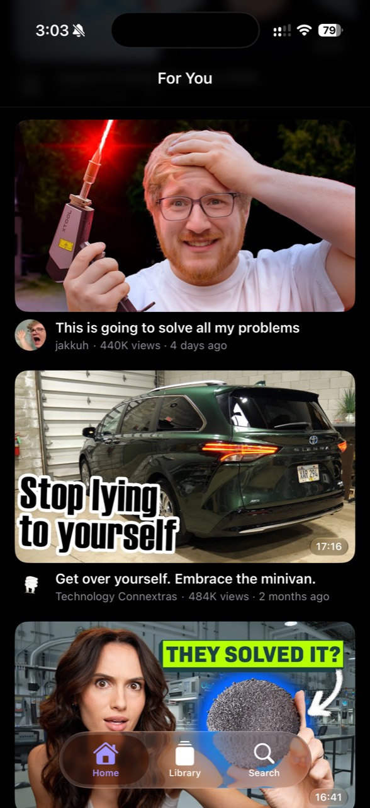
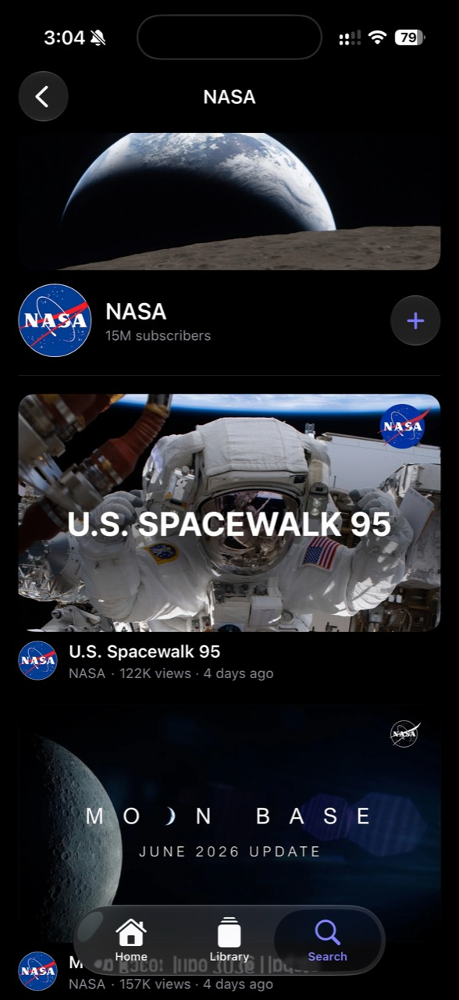
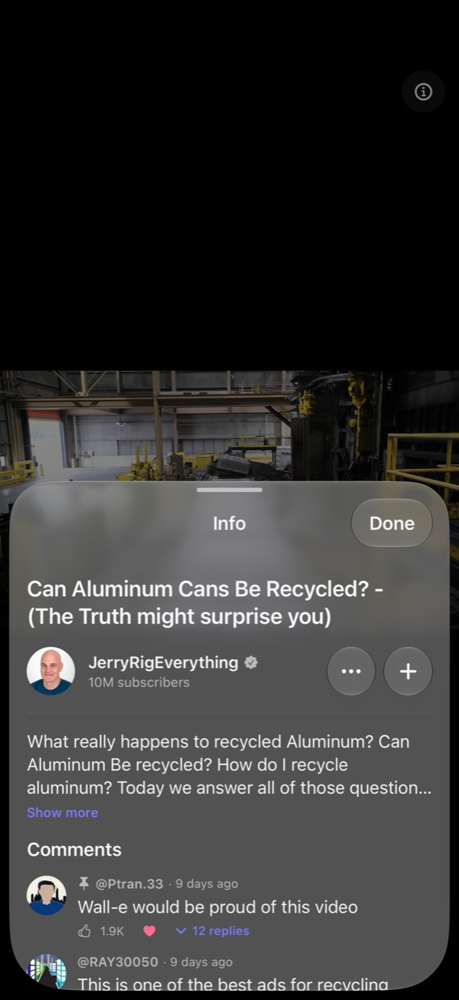
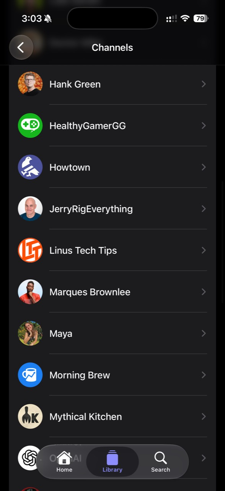

# Atlas

A native iOS YouTube client built on [Piped](https://github.com/TeamPiped/Piped).
SwiftUI + Liquid Glass, targeting iOS 26.

## Features

- **Feed** — subscriptions, an on-device "For You" mode, watched filtering, and
  configurable Shorts handling.
- **Channels and search** — channel pages, subscriptions, query suggestions, and
  video/channel search.
- **Player** — fullscreen or embedded AVPlayer with PiP, AirPlay, background
  audio, SponsorBlock, resume, a session queue, and tappable comment timestamps.
- **Info sheet** — channel subscribe, feedback, playlist saving, description,
  comments, and the current queue.
- **Playlists** — local playlists from card menus, the Info sheet, and App
  Shortcuts.
- **Downloads** — offline video and caption downloads.
- **Profile** — history, playlists, downloads, Topic Cloud, backup/restore,
  SponsorBlock settings, instance setup, and privacy policy.
- **App Shortcuts** — search, resume, open feed/downloads, play, download, find
  videos, and add to playlist.

## Architecture

- **`PipedKit/`** — Codable models, `PipedClient`, instance directory, and
  stream-selection logic.
- **`Atlas/`** — the SwiftUI app, organized as:
  - `App/` — entry point, `@Observable` `AppModel`, and root view
  - `Models/` — SwiftData `@Model` types (one per file: subscriptions, playlists, history)
  - `Features/` — feature-grouped screens (Feed, Channels, Search, Player, Downloads, Playlists, Profile, Recommendations)
  - `Components/` — reusable views (`VideoRow`, `Thumbnail`, `Avatar`, `CreatorChannelControl`, `GroupedVideoList`, …)
  - `Support/` — non-UI helpers (`Format`, `LoadPhase`, `ThumbnailPrefetcher`, `YouTubeCollaborators`)
- **`project.yml`** — source of truth for the Xcode project (generated by [xcodegen](https://github.com/yonaskolb/XcodeGen)).

For the full documentation system, start with [Docs/README.md](Docs/README.md).

## Build & run

```sh
# 1. (re)generate the Xcode project
xcodegen generate

# 2. open it
open Atlas.xcodeproj

# 3. select your iPhone, set the signing team if needed, ⌘R
```

Or from the CLI for the simulator:

```sh
xcodebuild -project Atlas.xcodeproj -scheme Atlas \
  -destination 'generic/platform=iOS Simulator' build CODE_SIGNING_ALLOWED=NO
```

Signing team and bundle id live in `project.yml` (`DEVELOPMENT_TEAM`, `PRODUCT_BUNDLE_IDENTIFIER`).

## Configuration

Atlas does not ship with a default Piped instance. Set one at runtime in
**Profile → Settings → Instance** before using online video features.

## Roadmap

- Audio-only mode
- Related video discovery
- Piped account sync
- Playlist sync/import improvements
- Push notifications for new uploads

## Screenshots

<p>
  
  
  
  
</p>
